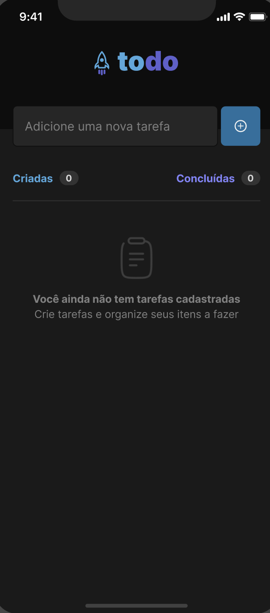
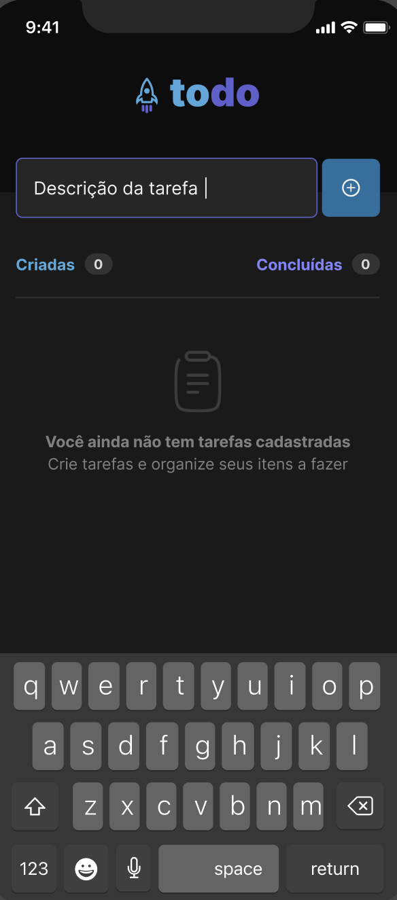
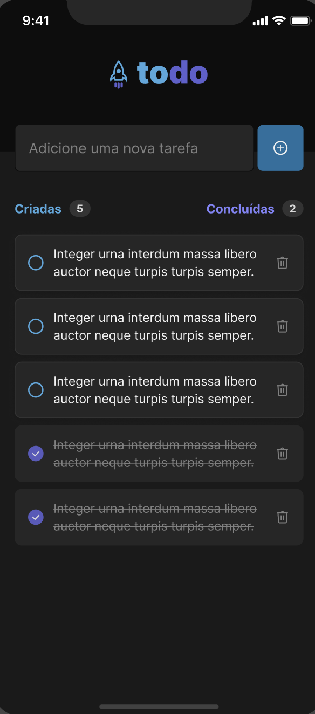

<h1 align="center">
  
   <br>
    Complementar challenge 01 - React Native ignite 2023
   
</h1>

<h3 align="center">
  Simple Todo
  <br><br><br>
   
    
    
</h3>

<br>

<p align="center">
  <a href="#rocket-technologies">Technologies</a>&nbsp;&nbsp;&nbsp;|&nbsp;&nbsp;&nbsp;
  <a href="#information_source-how-to-use">How use </a>&nbsp;&nbsp;&nbsp;|&nbsp;&nbsp;&nbsp;
  <a href="#computer-equipe">Squad</a>
</p>

## :rocket: Technologies

This project was developed with the following technologies:

- [Javascript](https://developer.mozilla.org/pt-BR/docs/Aprender/JavaScript)
- [TypeScript](https://www.typescriptlang.org/)
- [React-Native](https://reactnative.dev/)

## :information_source: How To Use

To clone and run this application, you'll need [Git](https://git-scm.com), [Node.js v18.x.x][nodejs] or higher installed on your computer. From your command line:

```bash
# Clone this repository
$ git clone https://github.com/rphmota/chalenge-reactnative-ignite-2023

$ cd chalenge-reactnative-ignite-2023

# install dependecies
$ npm install

# Run application
$ npx react-native start
$ npx react-native run-ios
$ npx react-native run-android

```

## :computer: Squad

- Raphael Mota